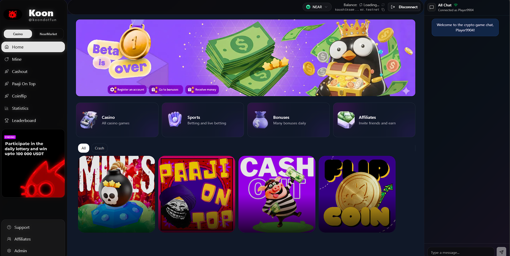
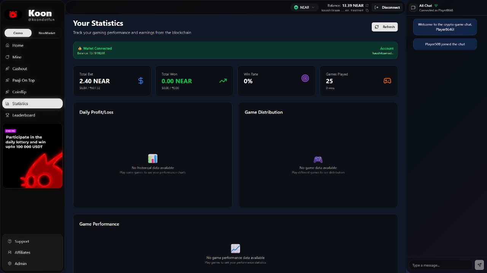
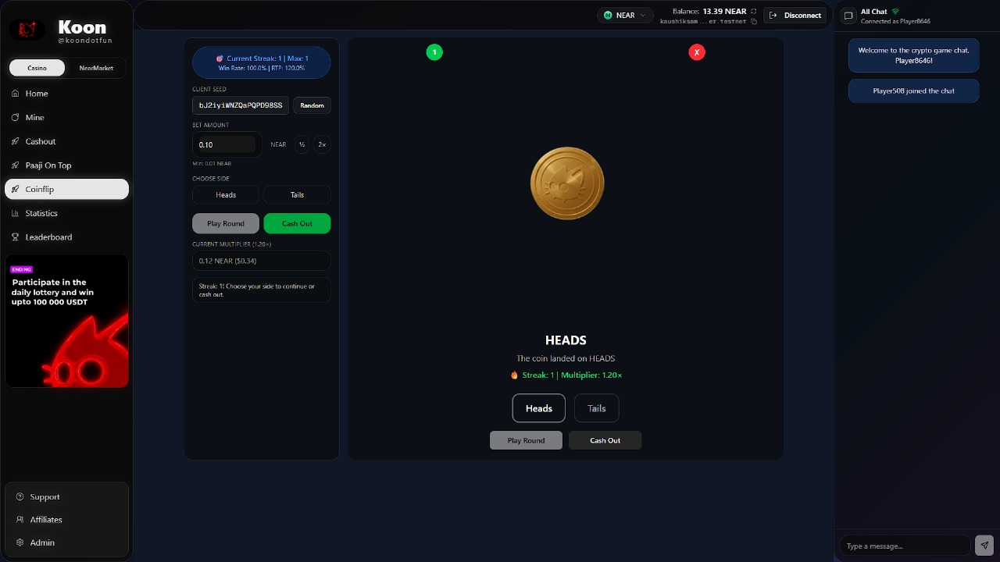
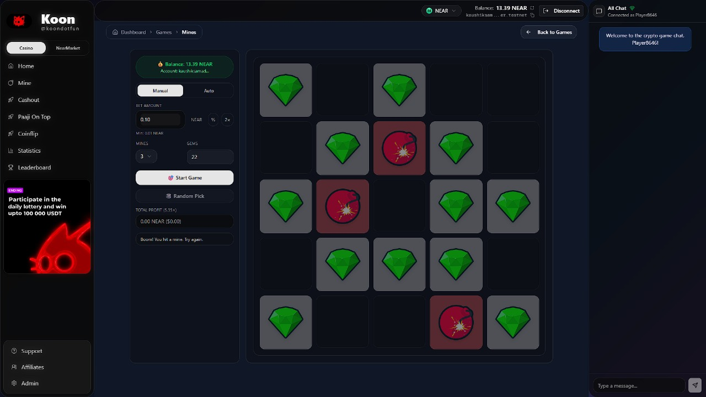
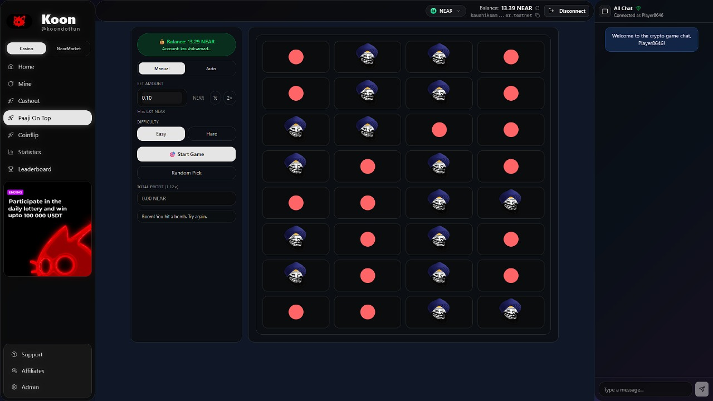

# 🎮 Kono - Cross-Chain Gaming Platform

A revolutionary blockchain-based gaming platform built on NEAR Protocol featuring multiple casino-style games with cross-chain withdrawals via NEAR Intents. Play on NEAR, withdraw on any chain!

    

<div align="center">
  
  <p><em>Experience the future of decentralized gaming</em></p>
</div>

## 🌟 Features

### 🎯 **Multiple Games**
- **Coinflip** - Classic heads or tails with customizable multipliers
- **Mines** - Risk vs reward minefield game with strategic gameplay
- **Rugs (Crash)** - High-stakes crash game with real-time multipliers
- **Paaji On Top** - Unique grid-based game with progressive rewards

### 🔐 **Blockchain Integration**
- **NEAR Protocol** - Fast, secure, and cost-effective transactions
- **NEAR Intents** - Cross-chain gaming with seamless withdrawals to any chain
- **Smart Contract** - Transparent, provably fair game logic
- **Automated Resolution** - No manual intervention required
- **Real-time Balance** - Live wallet balance updates
- **Multi-chain Support** - Play on NEAR, withdraw on any EVM chain

### 💰 **Financial Features**
- **Multi-currency Support** - NEAR, USD, INR conversions
- **Cross-chain Withdrawals** - Withdraw winnings to any EVM chain via NEAR Intents
- **Live Exchange Rates** - Real-time currency conversion
- **Balance Caching** - Optimized performance with smart caching
- **Universal Gaming** - Play on NEAR, cash out on Ethereum, Polygon, BSC, etc.

### 📊 **Analytics & Stats**
- **Personal Statistics** - Detailed gaming performance tracking
- **Leaderboard** - Global player rankings
- **Game History** - Complete transaction history
- **Performance Charts** - Visual analytics and trends

<div align="center">
  
  <p><em>Comprehensive performance tracking and analytics</em></p>
</div>

### 🎨 **Modern UI/UX**
- **Responsive Design** - Works on all devices
- **Dark Theme** - Eye-friendly gaming interface
- **Sound Effects** - Immersive audio feedback
- **Animations** - Smooth, engaging interactions

## 🚀 Quick Start

### Prerequisites
- Node.js 18+ 
- npm or yarn
- NEAR wallet (MyNearWallet, Sender, Meteor etc.)
### Installation

1. **Clone the repository**
```bash
git clone https://github.com/Debanjannnn/Loops kono
cd kono
```

2. **Install dependencies**
```bash
npm install
```

3. **Start development server**
```bash
npm run dev
```

4. **Open your browser**
Navigate to [http://localhost:3000](http://localhost:3000)

## 🌉 Cross-Chain Gaming with NEAR Intents

### 🚀 **Revolutionary Cross-Chain Experience**

Kono leverages **NEAR Intents** to provide seamless cross-chain gaming experiences:

#### **Current Implementation (Testnet)**
- **Play on NEAR** - All games run on NEAR Protocol for fast, cheap transactions
- **Withdraw on NEAR** - Direct withdrawals to NEAR wallet

#### **Future Implementation (Mainnet)**
- **Play on NEAR** - Continue gaming on NEAR's fast, low-cost network
- **Withdraw Anywhere** - Cash out winnings to any EVM chain:
  - 🟡 **Ethereum** - Withdraw to ETH mainnet
  - 🟣 **Polygon** - Withdraw to MATIC
  - 🟠 **BSC** - Withdraw to BNB Smart Chain
  - 🔵 **Arbitrum** - Withdraw to ARB
  - 🟢 **Optimism** - Withdraw to OP
  - And many more EVM-compatible chains!

#### **How NEAR Intents Work**
1. **Game on NEAR** - Play games using NEAR's superior performance
2. **Intent Creation** - Express intent to withdraw to specific chain
3. **Automatic Bridge** - NEAR Intents handle cross-chain transfer
4. **Receive on Target Chain** - Get your winnings on your preferred network

#### **Benefits**
- **Best of Both Worlds** - NEAR's speed + Any chain's ecosystem
- **No Manual Bridging** - Automated cross-chain transfers
- **Lower Fees** - Play on NEAR, pay minimal gas
- **Universal Access** - Withdraw to any wallet on any chain
- **Future-Proof** - Ready for multi-chain gaming expansion

### 🎯 **Multi-Chain Gaming Roadmap**

#### **Phase 1: NEAR Intents Integration** ✅
- Cross-chain withdrawals via NEAR Intents
- Support for major EVM chains
- Seamless user experience

#### **Phase 2: Multi-Chain Gaming** 🚧
- Play games on multiple chains
- Unified leaderboard across chains
- Cross-chain tournament support

#### **Phase 3: Universal Gaming** 🔮
- Play any game on any supported chain
- Cross-chain game progression
- Universal asset management

## 🎮 Available Games

### 🪙 Coinflip
- **Objective**: Predict heads or tails
- **Multipliers**: 1.95x for correct prediction
- **Risk Level**: Low
- **Strategy**: Pure chance with optimal betting

<div align="center">
  
  <p><em>Classic heads or tails with instant results</em></p>
</div>

### 💣 Mines
- **Objective**: Find gems while avoiding mines
- **Multipliers**: Up to 24x based on gems found
- **Risk Level**: Medium-High
- **Strategy**: Risk management and timing

<div align="center">
  
  <p><em>Navigate the minefield and collect gems</em></p>
</div>

### 🚀 Rugs (Crash)
- **Objective**: Cash out before the crash
- **Multipliers**: Dynamic, can reach 100x+
- **Risk Level**: High
- **Strategy**: Timing and risk assessment

### 🎯 Paaji On Top
- **Objective**: Navigate the grid to reach the top
- **Multipliers**: Progressive rewards
- **Risk Level**: Medium
- **Strategy**: Path optimization and risk management

<div align="center">
  
  <p><em>Strategic grid navigation with progressive rewards</em></p>
</div>

## 🏆 Global Leaderboard

Compete with players worldwide and climb the rankings!

<div align="center">
  
  <p><em>Track your progress against the best players globally</em></p>
</div>

## 🏗️ Architecture

### Frontend (Next.js 15)
```
components/
├── dashboard/          # Main dashboard components
├── games/             # Game implementations
├── ui/                # Reusable UI components
└── wallet/            # Wallet integration

lib/
├── contractService.ts # Smart contract interactions
├── currencyUtils.ts   # Currency conversion utilities
└── gameOutcomeService.ts # Game resolution logic
```

### Smart Contract (NEAR SDK JS)
```
contract/src/
└── contract.ts        # Main contract logic
    ├── UserStats      # User statistics tracking
    ├── Game           # Game state management
    └── Resolution     # Automated game resolution
```

### Resolver System
```
scripts/
├── resolver.js        # Automated game resolution
├── setup-resolver.js  # Resolver configuration
└── simple-resolver.js # Simplified resolution logic
```

## 🔧 Configuration

### Environment Variables

Create a `.env.local` file in the root directory:

```env
# NEAR Configuration
NEXT_PUBLIC_NEAR_NETWORK=testnet
NEXT_PUBLIC_CONTRACT_ID=game-v0.testnet

# Resolver Configuration (for automated resolution)
CONTRACT_ID=game-v0.testnet
RESOLVER_ACCOUNT_ID=resolver-v0.testnet
RESOLVER_PRIVATE_KEY=ed25519:YOUR_PRIVATE_KEY

# Optional
DEBUG=false
```

### Smart Contract Deployment

1. **Build the contract**
```bash
cd contract
npm run build
```

2. **Deploy to NEAR**
```bash
near deploy --wasmFile build/hello_near.wasm --accountId game-v0.testnet
```

3. **Initialize the contract**
```bash
near call game-v0.testnet new --accountId game-v0.testnet
```

## 🎯 Game Resolution System

Kono uses an automated resolver system that processes game outcomes without user intervention:

### How It Works
1. **User plays game** → Game state stored on-chain
2. **Resolver monitors** → Automated script checks for pending games
3. **Automatic resolution** → Games are resolved based on outcomes
4. **Winnings credited** → Users can withdraw from stats page

### Setup Resolver
```bash
# Install resolver dependencies
npm run setup-resolver

# Run resolver once
npm run resolver

# Run resolver continuously
npm run resolver:watch
```

## 📊 Smart Contract Methods

### User Methods
- `play_game(gameType, betAmount)` - Start a new game
- `withdraw()` - Withdraw winnings to wallet
- `get_user_stats(accountId)` - Get user statistics

### Resolver Methods
- `resolve_game(gameId, didWin, multiplier)` - Resolve a game
- `get_pending_games()` - Get all pending games
- `get_game_details(gameId)` - Get specific game details

### View Methods
- `get_all_users()` - Get all registered users
- `get_leaderboard()` - Get top players
- `get_contract_stats()` - Get platform statistics

## 🚀 Deployment

### Vercel Deployment

1. **Connect to Vercel**
```bash
npm install -g vercel
vercel login
```

2. **Deploy**
```bash
vercel --prod
```

3. **Set Environment Variables**
In Vercel dashboard, add:
- `CONTRACT_ID=game-v0.testnet`
- `RESOLVER_ACCOUNT_ID=resolver-v0.testnet`
- `RESOLVER_PRIVATE_KEY=ed25519:YOUR_KEY`

### Production Setup

See [PRODUCTION_SETUP.md](./PRODUCTION_SETUP.md) for detailed production deployment instructions.

## 🛠️ Development

### Available Scripts

```bash
# Development
npm run dev              # Start development server
npm run build           # Build for production
npm run start           # Start production server
npm run lint            # Run ESLint

# Resolver
npm run setup-resolver  # Setup resolver configuration
npm run resolver        # Run resolver once
npm run resolver:watch  # Run resolver continuously
```

### Project Structure

```
kono/
├── app/                    # Next.js app router pages
├── components/             # React components
│   ├── dashboard/         # Dashboard components
│   ├── games/             # Game implementations
│   └── ui/                # UI components
├── contexts/              # React contexts
├── lib/                   # Utility libraries
├── contract/              # NEAR smart contract
├── scripts/               # Resolver scripts
└── public/                # Static assets
```

## 🔒 Security Features

- **Provably Fair** - All game outcomes are verifiable on-chain
- **Automated Resolution** - No manual intervention required
- **Private Key Security** - Resolver keys stored securely
- **Access Control** - Only authorized accounts can resolve games
- **Transparent Transactions** - All actions recorded on blockchain

## 📈 Performance Optimizations

- **Balance Caching** - 30-second cache reduces API calls by 90%
- **Multiple RPC Endpoints** - Automatic fallback for reliability
- **Smart Retry Logic** - Handles network issues gracefully
- **Optimized Rendering** - React optimizations for smooth gameplay

## 🤝 Contributing

1. Fork the repository
2. Create a feature branch (`git checkout -b feature/amazing-feature`)
3. Commit your changes (`git commit -m 'Add amazing feature'`)
4. Push to the branch (`git push origin feature/amazing-feature`)
5. Open a Pull Request

## 📄 License

This project is licensed under the MIT License - see the [LICENSE](LICENSE) file for details.

## 🆘 Support

- **Documentation**: Check the `/docs` folder for detailed guides
- **Issues**: Report bugs via GitHub Issues
- **Discord**: Join our community for support
- **Email**: Contact us at support@kono.games

## 🎯 Roadmap

### 🌉 **Cross-Chain Features**
- [x] **NEAR Intents Integration** - Cross-chain withdrawals via NEAR Intents
- [ ] **Multi-Chain Gaming** - Play games on multiple blockchains
- [ ] **Universal Leaderboard** - Cross-chain player rankings
- [ ] **Cross-Chain Tournaments** - Multi-chain competitive events

### 🎮 **Gaming Features**
- [ ] **Mobile App** - React Native mobile application
- [ ] **Tournament Mode** - Competitive gaming tournaments
- [ ] **NFT Integration** - Gaming NFTs and rewards
- [ ] **Social Features** - Friends, chat, and social gaming
- [ ] **More Games** - Additional game types and variations

### 🔧 **Technical Improvements**
- [ ] **Layer 2 Integration** - Support for NEAR L2s
- [ ] **Advanced Analytics** - Enhanced performance tracking
- [ ] **AI-Powered Features** - Smart game recommendations
- [ ] **Enterprise APIs** - Developer tools and integrations

## 🙏 Acknowledgments

- **NEAR Protocol** - For the amazing blockchain infrastructure
- **Next.js Team** - For the excellent React framework
- **Open Source Community** - For the incredible tools and libraries

---

**Built with ❤️ by the Kono Team**

*Experience the future of decentralized gaming on NEAR Protocol*
