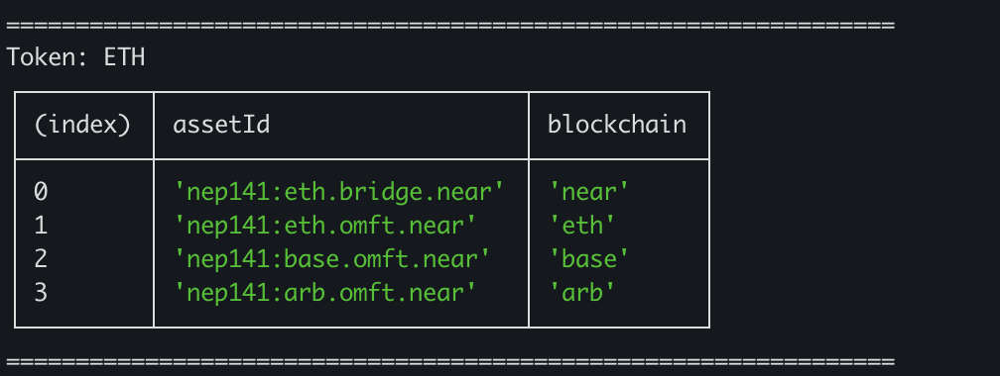

# Near 1Click API Integration (Node.js)

This repository provides a set of Node.js scripts to help you interact with NEAR Intents and the [1Click API](https://docs.near-intents.org/near-intents/integration/distribution-channels/1click-api) — a powerful new abstraction for cross-chain swaps.

The examples in this repository show how to:

- [Deposit](https://github.com/nearuaguild/near-intents-1click-example/blob/main/src/deposit.ts) `NEAR` tokens into the Intents contract
- [Swap](https://github.com/nearuaguild/near-intents-1click-example/blob/main/src/swap.ts) `NEAR` for `ETH` on NEAR Intents
- [Withdraw](https://github.com/nearuaguild/near-intents-1click-example/blob/main/src/withdraw.ts) the `ETH` tokens to Arbitrum
- [Deposit](https://github.com/nearuaguild/near-intents-1click-example/blob/main/src/deposit_arb.ts) the `ETH` tokens from Arbitrum to NEAR Intents again

---

## 1Click API

At its core, the 1Click API is built to generate swap quotes between different tokens, no matter in which chain they are located. It abstracts away the complexities of cross-chain swaps, allowing you to focus on the high-level logic of your application.

Each quote gives you all the details you need, including the input/output amounts. When asking for a quote there are two key parameters to pay attention:

- `depositType` – the source of the funds (which chain or asset you’re sending from)
- `recipientType` – the destination (which chain or asset you want to receive)

Suppose you want to swap native `BTC` on Bitcoin for `ETH` on Ethereum. That’s a **full cross-chain swap**. You’d set `depositType` to `ORIGIN_CHAIN` and `recipientType` to `ORIGIN_CHAIN`. The 1Click API would handle the orchestration, but you’d have to wait for Bitcoin finality before receiving your ETH. That could take several minutes, making it less than ideal for fast operations

Now let’s say you have `BTC` bridged to NEAR and want to swap it for `ETH` also on NEAR. This time, you will use the NEAR-native representations of both tokens. You’d set `depositType` to `INTENTS` and `recipientType` to `INTENTS`. The entire swap happens on NEAR with just one transaction, usually finalized in a second


### What Happens After You Get a Quote?

Each quote includes a `depositAddress`. If you're happy with the terms, just send the input tokens to that address. That’s it. The solver will pick up your transaction and complete the swap shortly after.

If for one reason or another the solver can’t fulfill your request, you will be refunded your tokens to the `refundTo` address you specified when requesting the quote.

>[!TIP]
> You can find the full API reference [here](https://docs.near-intents.org/near-intents/integration/distribution-channels/1click-api#post-v0-quote)

---

# Near Intents 1Click Example

## Environment Setup

1. **Install the Near CLI**

   You'll need [near.cli.rs](https://github.com/near/near-cli-rs) to interact with the NEAR blockchain from your terminal, you can install with `npm i -g near-cli-rs` 

2. **Create a NEAR account**

   The scripts assume you have a NEAR account (which you will use to control the tokens on NEAR Intents). If you don’t already have a NEAR account, you can create an implicit one (i.e. an account defined by 64 random characters) using the CLI:

   ```sh
   near account create-account fund-later use-auto-generation
   ```

   You will need to fund the account with NEAR tokens (0.1 N should be more than enough to play around)

> [!TIP]
> If you are at a hackathon, please approach a mentor to request some funds

> [!TIP]
> If you have funds on any chain, you can use the [`NEAR Intents` frontend](https://app.near-intents.org/) to swap tokens to NEAR

---

## Getting Started

1. **Clone the repository**

   ```sh
   git clone https://github.com/nearuaguild/near-intents-1click-example
   cd near-intents-1click-example
   ```

2. **Install the dependencies**

   Use any package manager, here we are using `Yarn`

   ```sh
   yarn install
   ```

3. **Set up environment variables**

   Copy the example environment file and fill the variables (your NEAR `account's Id` and `private key`, as well as your `evm` private key)

   ```sh
   cp .env.example .env
   ```

> [!NOTE]
> If you created a NEAR account using the CLI, you can retrieve its private key with:
> ```sh
> near account export-account <your_account> using-private-key network-config mainnet
> ```

---

## Understanding Multi-token Assets on NEAR

One of the powerful features of NEAR Intents is its support for multi-asset token standards. That means a single token, like ETH, can represent multiple bridged instances across different chains — each with a separate smart contract reference under the hood.

To see this in action, run:

```sh
yarn run tokens
```

You’ll see a table listing multiple representations of each token. Let’s take `ETH` as an example:



Despite being one token conceptually, `ETH` is displayed as multiple token entries, each tied to a specific chain (e.g., Ethereum Mainnet, Arbitrum, etc.). These are treated as distinct assets, and their balances are tracked separately.

To check how many tokens of each asset you own, use the following command:

```sh
near view intents.near mt_batch_balance_of '{"account_id": "<your_account>", "token_ids": ["nep141:wrap.near", "nep141:eth.bridge.near", "nep141:eth.omft.near", "nep141:base.omft.near", "nep141:arb.omft.near"]}' --networkId mainnet
```

Most likely, you'll see an array of zeros, it's totally fine at this point since you don't own any tokens yet.

---

## [Example 1](https://github.com/nearuaguild/near-intents-1click-example/blob/main/src/deposit.ts): Deposit NEAR to NEAR Intents

Let’s start by funding your account. As we saw earlier, your balances are at zero — so let’s change that.

Run the following script to convert 0.1 NEAR into a cross-chain token `nep141:wrap.near`. Since this is a purely on-chain action within NEAR, we don’t need the 1Click API here — just a straightforward token transfer.

```sh
yarn run deposit
```

Want to deposit a different amount? You can adjust the parameters passed to the `deposit()` function in `src/deposit.ts` file.

> We recommend depositing at least 0.1 NEAR — anything less may be rejected by solvers due to minimum fulfillment thresholds.

---

### [Example 2](https://github.com/nearuaguild/near-intents-1click-example/blob/main/src/swap.ts): Swap NEAR to ETH

With the cross-chain `NEAR` asset in your account, it’s time to perform the swap. You can check your updated balances using the same command as before — just to confirm the asset is there.

Then run the following script to swap the previously deposited `NEAR` for another cross-chain asset `ETH`, that is also on Near. Keep in mind that no Ethereum transactions are involved - this entire swap is executed on NEAR, leveraging bridged cross-chain assets for speed and efficiency.

```sh
yarn run swap
```

Want to swap a different amount? You can adjust the parameters passed to the `swap()` function in `src/swap.ts` file.

---

### [Example 3](https://github.com/nearuaguild/near-intents-1click-example/blob/main/src/withdraw.ts): Withdraw ETH to Arbitrum

You should now see `ETH` in your account — feel free to verify balances again. 

Let’s withdraw that `ETH` to Arbitrum. Before running, make sure to update:

- The amount of ETH to withdraw (`inputAmount`)
- The recipient Arbitrum wallet address (`receiverAddress`)

Both of these values can be configured in the parameters passed to the `withdraw()` function in `src/withdraw.ts` file.

Run the following command:

```sh
yarn run withdraw
```

Once the transaction is complete, you’ll get a link to view it on the Arbitrum Explorer — confirm there that your funds arrived.

---

### [Example 4](https://github.com/nearuaguild/near-intents-1click-example/blob/main/src/deposit_arb.ts): Deposit `ETH` back from Arbitrum

Now that you have `ETH` on Arbitrum, let’s walk through sending it back to Near as a cross-chain asset.

Before running the script, make sure to update the `inputAmount` in the parameters passed to the `deposit()` function in the `src/deposit_arb.ts` file. Keep in mind that you can’t transfer your entire `ETH` balance — some of it will be needed to cover transaction fees. Make sure to use an amount slightly below your available balance.

Run the following command:

```sh
yarn run deposit_arbitrum
```

Once the quote has been executed, use the previously mentioned balance command to check your cross-chain asset balances and confirm the update.

---

## Further Ideas — Challenge Yourself

Now that you’ve walked through the full NEAR to Arbitrum swap flow, why not flip the script?

As a challenge, try implementing the reverse path:

1. **Start on Arbitrum**

   Deposit native `ETH` from your Arbitrum wallet into the Intents contract via the 1Click API.

2. **Swap that ETH for NEAR**

   Use the 1Click API to swap `ETH` for `NEAR` as a cross-chain asset. This part must happen entirely on Near.

3. **Withdraw to your Near account**

   Complete the flow by withdrawing the `NEAR` tokens to your native balance.

This path mirrors the flow you've already implemented but in the opposite direction — and it's a great way to deepen your understanding of how the Intents system and 1Click API handle cross-chain logic.

Good luck.
